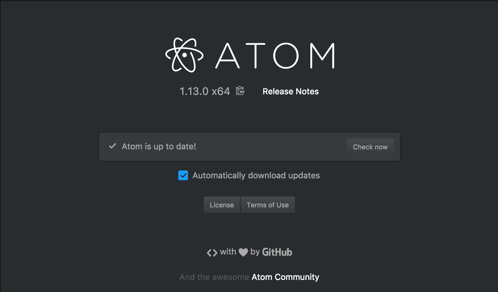

# url_shortener
 created by Janay Peters in the Web Design and Development program at Full Sail University.

# Purpose
 The purpose of this url shortener is to allow the user to enter a regular url and it return a unique shortend url.

# Installation Process
 Click the green button that says, "clone or Download" above on the right.
 After you have cloned or downloaded the application you will then need to open up your terminal and download a few things! 

 First: Install npm by typing "npm install"
 Second: Install nodemon by typing "npm install nodemon"
 Third: Start the server by typing "node src/server.js"
 Your server should be running on port 3000!

# Style Guide
Your IDE must support the latest ESLint plugin. Atom (https://atom.io) is recommended for your IDE.
  
First you want to install all of the following eslint packages:
npm i --save-dev --save eslint eslint-conig-airbnb eslint-plugin-import eslint-plugin-jsx-ally eslint-plugin-react. (You might have to install the jsx-ally seperate.)
You also want to go to the settings section in Atom and install the linter-eslint package, this will allow each file to lint.
Here is a link to the npm website that also has a great walk thorugh of how to install and use it as well.
 

# Workflow
First create a new feature branch, merge the feature branch into the master branch, create a new tag, and merge the master branch into the release branch.

# My Endpoints
POST /api/v1/urls
  Create a shortened URL
GET /api/v1/urls
  Display all URLS
GET /api/v1/urls/:id
  Display URL based upon id
POST /api/v1/urls/:id
  Update URL based upon id
DELETE  /api/v1/urls/:id
  Delete url based upon id
